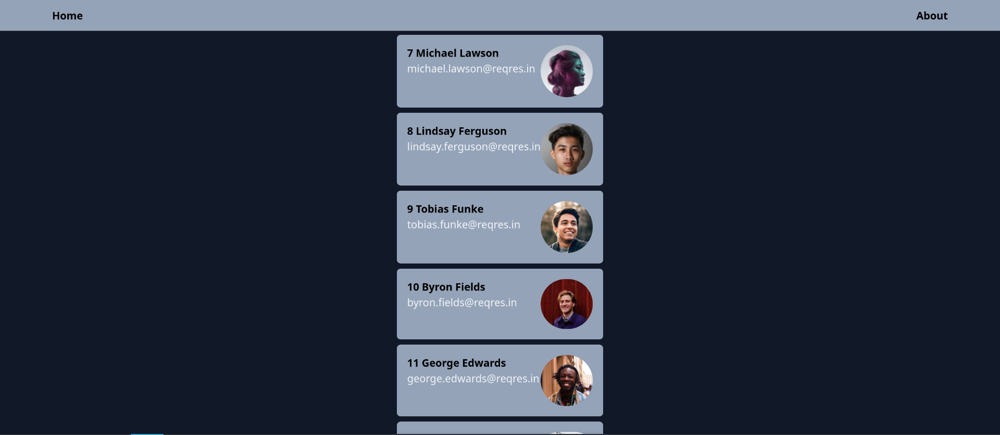

Este proyecto crea una interfaz sencilla para mostrar una lista de usuarios, utilizando la API pública de ReqRes ([https://reqres.in/](https://reqres.in/)). 




## Getting Started

First, run the development server:

```bash
npm run dev
# or
yarn dev
# or
pnpm dev
# or
bun dev
```

Open [http://localhost:3000](http://localhost:3000) with your browser to see the result.

You can start editing the page by modifying `app/page.tsx`. The page auto-updates as you edit the file.